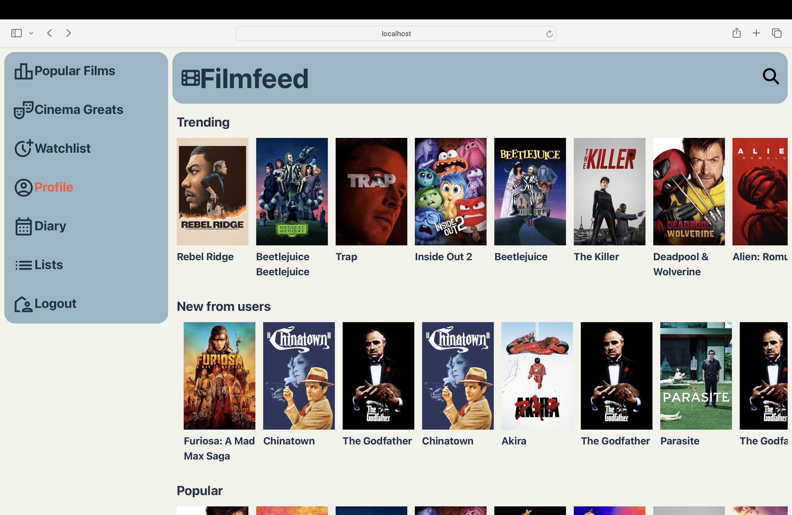

# Filmfeed

An app that allows users to search, rate/review, and learn about all of their favourite films. It allows users discover new films and aims to create an online film club community, future plans for the app include live chat functionality, allowing users to have discuss the film they are watching in real time!

Currently, the app is beta with a fully working prototype that users can create accounts, rate, review, search, add films to a watchlist, and create individual lists to help curate their films in anyway you like. Filmfeed allows users to create a profile, where they can add their current 4 favourite films, as well as add a profile picture. The profile page also shows each users stats: number of films logged, number of lists etc.

Filmfeed was built with the following technologies:

  
  
  
  
  
  
  
  
  
  

